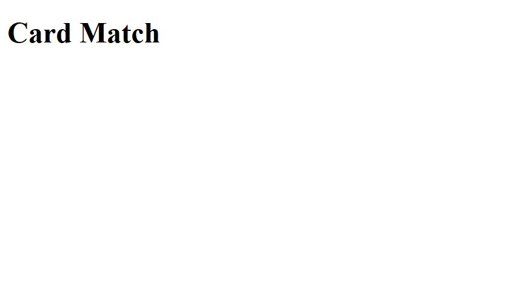
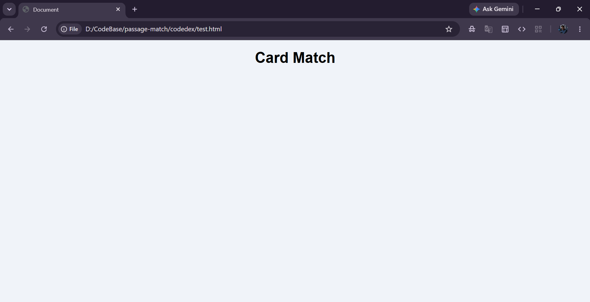
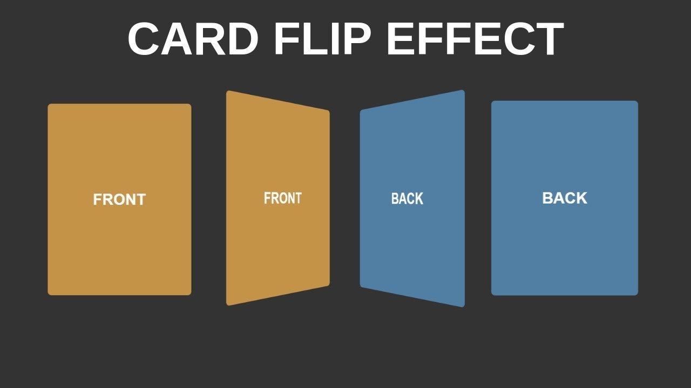
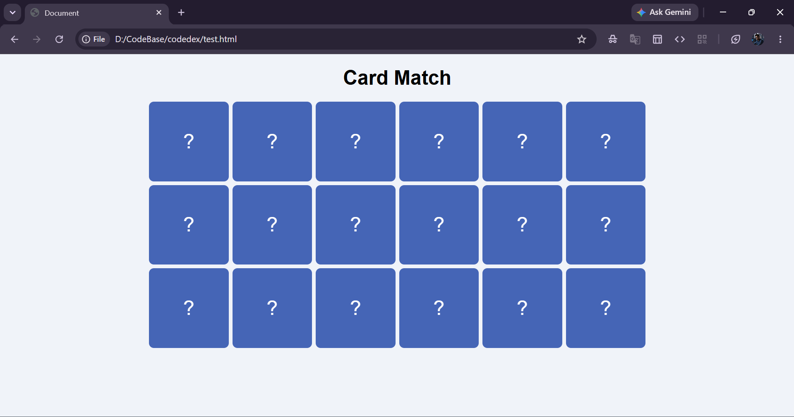

## Introduction

Remember those memory card games from childhood — the ones where you'd flip two
cards at a time, trying to find matching pairs? You'd flip one, remember where
the animal was, flip another... Nostalgic.

In this tutorial, we'll build our own **Memory Card Game** right in the browser
using HTML, CSS, and JavaScript.

Here's what you'll learn along the way:

- How to **structure a card grid** with HTML.
- How to create a **3D card flip animation** using CSS `perspective` and
  `transform`.
- How to handle **click events** and manage game state with JavaScript.
- How to detect **matching pairs** and determine when the game is won.

By the end, you'll have a fully working card matching game that looks like this:


**Note:** This tutorial assumes you're comfortable with the basics of HTML, CSS,
and JavaScript. We won't be explaining what a `<div>` is, but we will break down
anything tricky — like CSS 3D transforms and shuffling algorithms.

Let's dive into it!

## How Does a Memory Card Game Work?

Before we write any code, let's break down the game mechanics. Understanding the
"what" that makes "how" much easier.

### The Card Grid

A memory card game is a grid of face-down cards. Each card has an image on its
front and a uniform back. Every image appears exactly **twice** in the grid so
the player can find matching pairs.

### Shuffling

If the cards were always in the same order, then their will be no point of
struggle in it that is core of game playing. We need to **randomly shuffle** the
cards every time a new game starts. We'll use a random shuffle logic for this —
it's the go-to way to randomize an array fairly.

### Flipping and Matching

The game flow goes like this:

1. Player clicks a card → it flips face-up.
2. Player clicks a second card → it also flips face-up.
3. If the two cards match → they stay face-up with a visual highlight.
4. If they don't match → both flip back face-down after a short delay.
5. Repeat until all pairs are found.

### Locking the Board

While two cards are being compared, we need to **lock** the board — otherwise
the player could keep clicking and flip more than two cards at once. Once the
comparison is done (match or no match), we unlock and let them try again.

Now that we know how the game works, let's build it!

## Setting Up the Project

Create a new folder for the project. You can name it whatever you like —
something like `card-match` works. Inside it, create a single file:

```
card-match/
  ├── index.html
  └── assets/
       ├── image1.png
       ├── image2.png
       └── ... (your card images)
```

We'll keep everything in one `index.html` file — the HTML, CSS, and JavaScript
all together. This keeps things simple and easy to follow.

For the card images, you can use any set of images you like. You'll need **9
unique images** (since each appears twice, that gives us 18 cards for a 6×3
grid). Drop them in an `assets/` folder.

**Tip:** If you don't have images ready, search for free icon sets or use
emoji-based cards. The game logic works the same regardless.

Now, open `index.html` in your code editor. If you're using VS Code, you can
type `!` and hit **Tab** to generate the HTML boilerplate using Emmet
abbreviation:

```html
<!DOCTYPE html>
<html lang="en">
    <head>
        <meta charset="UTF-8">
        <meta name="viewport" content="width=device-width, initial-scale=1.0">
        <title>Document</title>
    </head>
    <body></body>
</html>
```

This gives us the standard HTML5 structure — `DOCTYPE`, a `<head>` with
character encoding and viewport settings, and an empty `<body>` ready for our
game.

## Step 1: Building the HTML Structure

Our game needs two things on the page: a **heading** (for title) and a **grid
container** where the cards will go. The cards themselves will be created by
JavaScript later, so the HTML is pretty minimal.

Add the following inside the `<body>` tag:

```html
<h1>Card Match</h1>

<div class="container">
    <!-- Card Grid -->
    <div class="grid" id="grid"></div>
</div>
```

If you open this in a browser right now, you'll just see the heading "Card
Match" on a blank page. That's expected — we haven't added any styles or card
elements yet.



## Step 2: Styling with CSS

Now let's make things look good. Add a `<style>` tag inside the `<head>` section
of your HTML.

### Base Styles

```css
* {
    box-sizing: border-box;
    margin: 0;
    padding: 0;
}
body {
    font-family: Arial, Helvetica, sans-serif;
    background: #f0f3f9;
    display: flex;
    flex-direction: column;
    align-items: center;
    padding: 20px;
}

h1 {
    margin-bottom: 20px;
}
.container {
    max-width: 800px;
    width: 100%;
}
.grid {
    display: grid;
    grid-template-columns: repeat(6, 1fr);
    gap: 6px;
}
```

Let's walk through this briefly:

- The `*` selector resets margins and padding on everything, and
  `box-sizing: border-box` ensures padding doesn't mess with element widths.
- The `body` uses flexbox to center everything vertically in a column layout
  with a light gray background.
- The `.container` caps the grid at 800px wide so it doesn't stretch on large
  screens.
- The `.grid` uses CSS Grid with **6 columns** of equal width. The `gap: 6px`
  adds a small space between cards.

Now, Our page will start looking similar to final game web page, after applying css styles, page will look like this:



### Card Styles and the 3D Flip

Now the important css styling that helps in making game UI more appealing. Each card has a **front** (the image) and a **back** (the hidden side). We need the card to literally "flip" in 3D space when clicked. CSS makes this possible with a few key properties.

```css
.card {
    position: relative;
    width: 100%;
    padding-top: 100%;
    cursor: pointer;
    perspective: 800px;
}
.card-inner {
    position: absolute;
    top: 0;
    left: 0;
    right: 0;
    bottom: 0;
    transition: transform 0.4s;
    transform-style: preserve-3d;
}
.card-inner.flipped {
    transform: rotateY(180deg);
}
.card-face {
    position: absolute;
    width: 100%;
    height: 100%;
    backface-visibility: hidden;
    border-radius: 8px;
    display: flex;
    align-items: center;
    justify-content: center;
}

.card-front {
    background: #ffffff;
    border: 2px solid #e2e8f0;
    transform: rotateY(180deg);
}

.card-back {
    background: #4565b6;
    color: #ffffff;
    font-size: 2rem;
}

.card-inner.matched .card-front {
    border-color: #22c55e;
    background: #f0fdf4;
}
```

This is the trickiest CSS in the project, so let's unpack the important parts:

- **`perspective: 800px`** on `.card` — This creates a 3D space for the card to
  flip in. Without `perspective`, the rotation would look flat and 2D. The value
  `800px` controls how 3D effect is — smaller values = more extreme
  perspective.

- **`transform-style: preserve-3d`** on `.card-inner` — This tells the browser
  that the children of this element (the front and back faces) should exist in
  3D space, not be flattened. Without this, the flip animation wouldn't work.

- **`backface-visibility: hidden`** on `.card-face` — Each card has two faces
  stacked on top of each other. This property hides the face that's currently
  facing away from the viewer. Without it, you'd see a mirrored version of the
  back face when the card flips.

- **`transform: rotateY(180deg)`** on `.card-front` — The front face starts
  rotated 180° (hidden). When we add the `.flipped` class to `.card-inner`, it
  rotates the whole inner container 180°, which brings the front face into view
  and hides the back.

- **`.card-inner.matched .card-front`** — When a pair is matched, we add a
  `matched` class. This changes the border to green and the background to a
  light green, giving visual indication that card is matched.

The `padding-top: 100%` trick on `.card` makes each card a perfect square — a
classic CSS technique where percentage-based padding is calculated from the
element's width.

Here's a quick visual of how the 3D flip works:



At this point, if you open the browser, you'll see... the same heading on a gray
background. That's because we haven't added any card elements yet. The CSS is
ready and waiting. Time for JavaScript!

## Step 3: Setting Up Game Variables

Add a `<script>` tag just before the closing `</body>` tag. Let's start by
defining our game data and variables.

```javascript
const cardImages = [
    { name: "FIFA Cup", file: "fifa_cup.png" },
    { name: "FIFA", file: "fifa.png" },
    { name: "USA FC", file: "usa_fc.png" },
    { name: "Canada FC", file: "canada_fc.png" },
    { name: "Jersey 7", file: "jersey_7.png" },
    { name: "Jersey 10", file: "jersey_10.png" },
    { name: "Argentina Ball", file: "argentina_ball.png" },
    { name: "Bicycle Kick", file: "bicycle_kick.png" },
    { name: "Golden Boot", file: "golden_boot.png" },
];

const gridContainer = document.getElementById("grid");
let allCards = [];
let firstCardId = null;
let secondCardId = null;
let isLocked = false;
let isPlaying = false;
let cardIdCounter = 0;
```

Let's go through what each variable does:

- **`cardImages`** — An array of objects, each with a `name` and a `file`. The
  `name` is what we'll compare to check if two cards match, and the `file`
  points to the image in the `assets/` folder. You can swap these out for your
  own images — just make sure each has a unique `name`.

- **`gridContainer`** — A reference to our empty `<div id="grid">` element.
  We'll inject card HTML into this.

- **`allCards`** — Will hold the full list of shuffled cards (each image appears
  twice). Starts empty.

- **`firstCardId` / `secondCardId`** — Track the IDs of the two currently
  selected cards. `null` means nothing is selected yet.

- **`isLocked`** — When `true`, clicks are ignored. This prevents the player
  from flipping a third card while the first two are still being compared.

- **`isPlaying`** — Controls whether the game has started. We'll set this to
  `true` when the game initializes.

- **`cardIdCounter`** — A simple counter to give each card a unique ID.

**Note:** Replace the `cardImages` array with your own images if you want otherwise you can use assets folder from tutorial demo repo. The `name` field
is used for matching — two cards with the same `name` are a pair.


## Step 4: Shuffling the Cards

Now, We need a way to randomly shuffle an array. We'll use a for loop that goes through the array from the end to the beginning, swapping each element with a random earlier element.

```javascript
function shuffleArray(inputArray) {
    // Copy so we don't change the original
    const copy = [...inputArray];

    // Randomly shuffling all cards array
    for (let i = copy.length - 1; i > 0; i--) {
        const randomIndex = Math.floor(Math.random() * (i + 1));
        const temp = copy[i];
        copy[i] = copy[randomIndex];
        copy[randomIndex] = temp;
    }

    return copy;
}
```

How this works:

1. We create a **copy** of the input array using the spread operator
   (`[...inputArray]`) so we don't modify the original.
2. Starting from the **last element**, we pick a random index between `0` and
   `i` (inclusive).
3. We **swap** the current element with the randomly picked one.
4. We move one position left and repeat.

This guarantees every possible arrangement is equally likely — no bias. The
result is a perfectly shuffled array.

## Step 5: Building the Card List

Now we need a function that takes our 9 unique images, **duplicates** them (so
each appears twice), **shuffles** the whole thing, and gives each card a unique
**ID**.

```javascript
function buildCardList() {
    // Spread twice so every image appears exactly 2 times
    const pairedImages = [...cardImages, ...cardImages];
    const shuffled = shuffleArray(pairedImages);

    return shuffled.map(function (image) {
        cardIdCounter = cardIdCounter + 1;
        return {
            id: cardIdCounter,
            name: image.name,
            file: image.file,
            matched: false, // becomes true once the pair is found
        };
    });
}
```

Here's the breakdown:

- **`[...cardImages, ...cardImages]`** — Spread the array twice to create 18
  items (9 pairs). Each image now appears twice.
- **`shuffleArray(pairedImages)`** — Randomize the order so cards aren't next to
  their pair.
- **`.map()`** — Transform each image into a **card object** with:
  - `id` — A unique number for identifying this specific card element.
  - `name` — Used for matching. Two cards with the same `name` are a pair.
  - `file` — The image filename.
  - `matched` — Starts as `false`. We set it to `true` once the player finds the
    pair.

## Step 6: Rendering Cards to the Page

We have an array of card data. Now we need to turn it into actual HTML elements
on the page.

```javascript
function renderGrid() {
    let html = "";

    for (let i = 0; i < allCards.length; i++) {
        const card = allCards[i];
        html += `
            <div class="card" data-id="${card.id}">
                <div class="card-inner" data-id="${card.id}">
                    <div class="card-face card-front">
                        
                    </div>
                    <div class="card-face card-back">?</div>
                </div>
            </div>
        `;
    }

    gridContainer.innerHTML = html;
}
```

This function loops through every card in `allCards` and builds an HTML string
using **template literals** (the backtick strings with `${}`).

Each card's HTML has this structure:

- **`.card`** — The outer wrapper. Holds the `data-id` attribute so we can
  identify which card was clicked.
- **`.card-inner`** — The element that actually rotates when we add the
  `flipped` class.
- **`.card-front`** — The face with the image. Remember, this starts rotated
  180° in CSS (hidden).
- **`.card-back`** — The face the player sees initially. Shows a `?` symbol.

We store the `data-id` on both `.card` and `.card-inner` because different parts
of the code need to find cards by ID — we'll use it in click handlers and visual
updates.

After building the full HTML string, `gridContainer.innerHTML = html` injects it
all at once into the DOM.



## Step 7: Updating Card Visuals

When a card is clicked or matched, we need to update its appearance. Rather than
adding/removing classes on individual click events, we take a collective
approach — one function that looks at the current game state and updates
**every** card accordingly.

```javascript
function updateCardVisuals() {
    for (let i = 0; i < allCards.length; i++) {
        const card = allCards[i];
        const cardInner = document.querySelector(
            `.card-inner[data-id="${card.id}"]`,
        );

        // Decide whether this card should be flipped (face-up)
        const isFirstSelected = card.id === firstCardId;
        const isSecondSelected = card.id === secondCardId;
        const isMatched = card.matched;
        const shouldBeFlipped = isFirstSelected || isSecondSelected ||
            isMatched;

        // Add or remove the "flipped" class based on the decision above
        if (shouldBeFlipped) {
            cardInner.classList.add("flipped");
        } else {
            cardInner.classList.remove("flipped");
        }

        // Add or remove the "matched" class for the green border
        if (isMatched) {
            cardInner.classList.add("matched");
        } else {
            cardInner.classList.remove("matched");
        }
    }
}
```

This function is the **single source of truth** for card visuals. Every time the
game state changes (a card is selected, a match is found, cards are flipped
back), we call `updateCardVisuals()` and it makes the DOM reflect the current
state.

For each card, it checks three things:

1. Is this the **first selected** card? → flip it.
2. Is this the **second selected** card? → flip it.
3. Is this card **matched**? → keep it flipped and add the green border.

If none of these are true, the card stays (or goes back to) face-down.

This is a state based approach where each variable allows to handle application state seamlessly like flipping, matching etc.

## Step 8: Helper Functions

We need two small helper functions before the core game logic.

### Resetting the Selection

After a pair is checked (whether it matched or not), we need to clear the
selection and unlock the board:

```javascript
function resetSelection() {
    firstCardId = null;
    secondCardId = null;
    isLocked = false;
}
```

### Checking if All Cards Are Matched

To know when the game is over, we check if every card in the array has `matched`
set to `true`:

```javascript
function checkAllMatched() {
    for (let i = 0; i < allCards.length; i++) {
        if (allCards[i].matched === false) {
            return false; // at least one card is still unmatched
        }
    }
    return true; // every card is matched
}
```

These are straightforward — `resetSelection` clears the current turn, and
`checkAllMatched` loops through all cards to see if we're done.

## Step 9: Checking for a Match

When the player flips two cards, we need to compare them. This is the heart of
the game logic:

```javascript
function checkMatch() {
    const firstCard = allCards.find(function (c) {
        return c.id === firstCardId;
    });
    const secondCard = allCards.find(function (c) {
        return c.id === secondCardId;
    });

    const isMatch = firstCard.name === secondCard.name;

    if (isMatch) {
        // Mark both cards as matched
        firstCard.matched = true;
        secondCard.matched = true;

        // Short delay so the player can see them flip before we reset
        setTimeout(function () {
            resetSelection();
            updateCardVisuals();

            // Check if the whole board is cleared
            if (checkAllMatched()) {
                isPlaying = false;
                alert("Wow! You matched all the cards! Well done!");
            }
        }, 400);
    } else {
        // Not a match – flip both cards back after a short pause
        setTimeout(function () {
            resetSelection();
            updateCardVisuals();
        }, 800);
    }
}
```

Let's walk through both paths:

**If the cards match:**

1. We set `matched = true` on both card objects.
2. After a **400ms delay** (so the player can see both cards face-up), we reset
   the selection and update visuals.
3. We also check if **all cards** are now matched. If yes — game over! We show a
   congratulations alert.

**If the cards don't match:**

1. After an **800ms delay** (giving the player time to memorize the images), we
   reset the selection and flip both cards back face-down.

The `setTimeout` delays helps user to memorize the cards, adding small delay make it harder to remember and long delays could make slower. Hence, 800ms works effeciently here.

## Step 10: Handling Card Clicks

Now we wire up the click handler — the function that runs every time the player
clicks anywhere on the page:

```javascript
function handleCardClick(event) {
    // Walk up the DOM to find the nearest .card element
    const clickedCard = event.target.closest(".card");

    // Ignore clicks outside a card, or while waiting
    if (clickedCard === null) return;
    if (isLocked === true) return;
    if (isPlaying === false) return;

    // Convert the data-id attribute from string to number
    const clickedId = Number(clickedCard.dataset.id);

    // Find the matching card object
    const card = allCards.find(function (c) {
        return c.id === clickedId;
    });

    // Ignore already-matched cards or a double-click on the same card
    if (card.matched === true) return;
    if (card.id === firstCardId) return;

    if (firstCardId === null) {
        // First card of the pair – just save it and flip it
        firstCardId = card.id;
        updateCardVisuals();
    } else {
        // Second card of the pair – lock the board, flip, then check
        secondCardId = card.id;
        isLocked = true;
        updateCardVisuals();
        checkMatch();
    }
}
```

This function has a lot of **early returns** — those `if (...) { return; }`
lines at the top. They act as guards, filtering out clicks we don't care about:

- **`clickedCard === null`** — The click was outside any card element (maybe on
  the background).
- **`isLocked === true`** — Two cards are currently being compared. Don't allow
  a third flip.
- **`isPlaying === false`** — The game hasn't started yet (or just ended).
- **`card.matched === true`** — This card's pair was already found. Ignore it.
- **`card.id === firstCardId`** — The player clicked the same card twice. Ignore
  it.

If a click passes all guards, we check if it's the **first** or **second** card
of the turn:

- **First card:** Save its ID in `firstCardId` and flip it.
- **Second card:** Save its ID in `secondCardId`, **lock the board**, flip it,
  and call `checkMatch()`.

Notice we use `event.target.closest(".card")` instead of checking `event.target`
directly. The player might click on the image, the `?` text, or the card face —
`.closest()` walks up the DOM tree to find the nearest `.card` ancestor. This is
a tricky pattern that we need for handling clicks on cards.

[Read More about closest()](https://developer.mozilla.org/en-US/docs/Web/API/Element/closest)

## Step 11: Starting the Game

Finally, let's wire everything together with the `startGame` function and the
event listeners:

```javascript
function startGame() {
    allCards = buildCardList();
    isPlaying = true;
    resetSelection();
    renderGrid();
    updateCardVisuals();
}

document.addEventListener("click", handleCardClick);

// Start the game
window.addEventListener("load", startGame);
```

The `startGame` function:

1. **Builds the card list** — Creates 18 cards (9 pairs), shuffles them, assigns
   IDs.
2. **Sets `isPlaying` to `true`** — Enables click handling.
3. **Resets the selection** — Clears any leftover state.
4. **Renders the grid** — Injects the card HTML into the page.
5. **Updates visuals** — Makes sure all cards start face-down.

We register `handleCardClick` on the **document** rather than on individual
cards. This is called **event delegation** — instead of attaching a listener to
each of the 18 cards, we attach one listener to the parent and use
`event.target.closest()` to figure out which card was clicked. It's more
efficient and works even after we replace the grid HTML.

The `window.addEventListener("load", startGame)` makes sure the game starts only
after the page has fully loaded.

## Complete Code

You can get whole code and assets from following github repo:

[Memory Game Repository](https://github.com/abhinavthedev/memory-game)

Clone the repository and open `index.html` in your browser. 

You should see a grid of blue cards
with question marks. Click any card to flip it, click another to try a match. If
they match, they'll stay face-up with a green border. If not, they'll flip back
after a moment.


## What's Next?

Congrats! You just built a fully working memory card game from scratch. Here are
some ideas to take it further:

- **Add a move counter** — Track how many attempts the player makes and display
  it on screen.
- **Add a timer** — Challenge the player to match all pairs as fast as possible.
- **Difficulty levels** — Let the player choose grid sizes (4×3, 6×3, 8×4) for
  easy, medium, and hard modes.
- **Score system** — Award more points for fewer moves or faster times.
- **Restart button** — Let the player reset the board without refreshing the
  page.
- **Sound effects** — Add flip, match, and victory sounds for a more immersive
  experience.
- **Animations** — Add a card shake animation when there's no match, or a bounce
  effect when there is.

### Troubleshooting

- Make sure you have at least 9 images in assets folder in your root folder (where your index.html is placed.)
- If anything not works, check javascript functions.

Happy coding! 🃏

